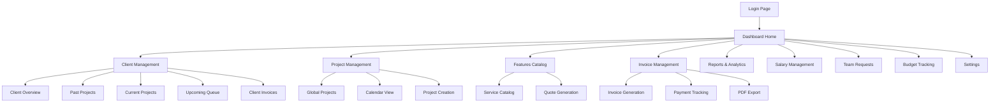

# Devs On Steroids Internal CRM - Product Requirements Document

## 1. Product Overview

A comprehensive single-user internal CRM web application for Devs On Steroids IT Services and Development Agency to manage clients, projects, invoices, team assignments, salaries, internal requests, and budgets for global custom-coded solutions.

This personal management tool enables TroubleShooter (Co-Founder & CEO) to track all business operations including client interactions, project lifecycles, financial management, and team coordination for the agency's worldwide client base specializing in from-scratch development solutions.

Target: Streamline business operations and provide centralized management for a growing global IT services agency with custom development focus.

## 2. Core Features

### 2.1 User Roles

| Role | Registration Method | Core Permissions |
|------|---------------------|------------------|
| Admin User (TroubleShooter) | Single login with email/password | Full access to all CRM features, data management, and system settings |

### 2.2 Feature Module

Our CRM system consists of the following main pages:

1. **Dashboard Home**: hero section with stat cards, sidebar navigation, global search, mini-charts for business metrics
2. **Client Management**: client profiles with tabs for overview, projects, invoices, and notes
3. **Project Management**: global project tracking, kanban boards, calendar views, milestone management
4. **Features Catalog**: reusable service catalog for quoting and project scoping
5. **Invoice Management**: invoice generation with customizable templates, PDF export, payment tracking, automated reminders
6. **Reports & Analytics**: comprehensive business reporting with charts and export capabilities
7. **Salary Management**: employee salary tracking, payment history, budget calculations
8. **Team Requests**: internal request management with kanban workflow
9. **Budget Tracking**: departmental budget management, expense tracking, variance analysis
10. **Settings**: system configuration, company profile, notification preferences
11. **Login Page**: secure authentication for single admin user

### 2.3 Page Details

| Page Name | Module Name | Feature description |
|-----------|-------------|---------------------|
| Dashboard Home | Hero Section | Display key business metrics with stat cards: Active Clients, Pending Payments, Upcoming Projects, Overdue Invoices, Total Salary Outlay, Budget Variance |
| Dashboard Home | Sidebar Navigation | Provide navigation to all main sections: Clients, Projects, Invoices, Features Catalog, Reports, Salaries, Team Requests, Budgets, Settings |
| Dashboard Home | Global Search | Search across all sections with real-time results and filtering |
| Dashboard Home | Mini Charts | Display revenue trends, project type distribution, monthly budget analysis using Recharts |
| Client Management | Client Overview | Manage client details: name, company, location, contacts, website, total spend, notes, status (Active/Inactive/Lead), reference source (how client was acquired) |
| Client Management | Past Projects Tab | Timeline view of completed projects with details: name, type, dates, description, quotation, scope, deliverables, assigned employees, hours, cost breakdown |
| Client Management | Current Projects Tab | Real-time project tracking with progress bars, assignees, bottlenecks, milestones using Supabase Realtime |
| Client Management | Upcoming Queue Tab | Kanban board for project pipeline: Backlog, Ready to Quote, Quoted, Scheduled with drag-drop prioritization |
| Client Management | Invoices Tab | Client-specific invoice listing with payment status and totals |
| Project Management | Global Projects | Aggregate view of all projects with filters by status, department, type, date range |
| Project Management | Project Creation | Modal forms for creating/editing projects with milestone tracking, risk logging, hours tracking, detailed work scope definition |
| Project Management | Calendar View | Project deadlines, milestones, probable starts using react-big-calendar |
| Features Catalog | Service Catalog | Editable table of reusable features by category: Development, Design, Mobile, E-comm, Other with descriptions and notes |
| Features Catalog | Quote Generation | Multi-select features with manual pricing, tax/discount calculations, PDF generation using jsPDF |
| Invoice Management | Invoice Generation | Create invoices from quotes or manual entry with auto-incrementing numbers (DOS-001, DOS-002) |
| Invoice Management | Invoice Template Editor | Dedicated template management system with company logo upload, address configuration, theme customization, and layout options |
| Invoice Management | PDF Export | Generate professional invoices using customizable templates with company branding and detailed formatting |
| Invoice Management | Payment Tracking | Log full/partial payments with automatic status updates |
| Invoice Management | Email Integration | Send invoices and reminders via Supabase Edge Functions |
| Reports & Analytics | Business Overview | Total revenue, active projects, client metrics, salary summaries |
| Reports & Analytics | Client Analytics | Spend per client, project counts, average durations |
| Reports & Analytics | Department Load | Hours assigned vs completed per department with capacity analysis |
| Reports & Analytics | Chart Visualizations | Interactive charts using Recharts with PNG/PDF export |
| Salary Management | Employee Salaries | Set monthly salaries for fixed employee list with annual calculations |
| Salary Management | Payment History | Track salary payments with dates, amounts, methods, pending status |
| Salary Management | Budget Integration | Link salary costs to departmental budgets with variance tracking |
| Team Requests | Request Management | Internal team requests with priority, assignee, due dates, status tracking |
| Team Requests | Kanban Workflow | Drag-drop request prioritization with status columns |
| Budget Tracking | Department Budgets | Set and track budgets by department with expense categorization |
| Budget Tracking | Variance Analysis | Compare actual vs budgeted expenses with alerts for overages |
| Settings | Company Profile | Manage company information, logo upload, contact details |
| Settings | System Configuration | Theme toggle (dark/light), notification preferences, tax rates |
| Login Page | Authentication | Secure login using Supabase Auth with JWT tokens |

## 3. Core Process

**Admin User Flow:**
The admin user (TroubleShooter) logs in and accesses the dashboard to view business metrics. They can navigate to client management to add new clients, track existing relationships, and manage project pipelines. For new projects, they use the features catalog to create quotes, generate professional PDFs, and convert quotes to invoices. The system tracks project progress through kanban boards and calendar views, while salary and budget management ensures financial oversight. Team requests facilitate internal coordination, and comprehensive reporting provides business insights.

## 4. User Interface Design

### 4.1 Design Style

- **Primary Colors**: Blue (#3B82F6) for headers and primary actions, Dark Gray (#1F2937) for text
- **Secondary Colors**: Green (#10B981) for success states, Red (#EF4444) for alerts, Yellow (#F59E0B) for warnings
- **Button Style**: Rounded corners (8px), subtle shadows, hover states with color transitions
- **Font**: Inter or system fonts, 14px base size, 16px for headings, 12px for captions
- **Layout Style**: Card-based design with clean borders, sidebar navigation, top header bar
- **Icons**: Heroicons or Lucide React icons for consistency and modern appearance

### 4.2 Page Design Overview

| Page Name | Module Name | UI Elements |
|-----------|-------------|-------------|
| Dashboard Home | Hero Section | Grid layout with 6 stat cards, blue gradient backgrounds, white text, shadow effects |
| Dashboard Home | Sidebar | Fixed left sidebar, dark theme, white icons, hover states, collapsible on mobile |
| Dashboard Home | Charts | Responsive chart containers, Recharts components, tooltips, legend positioning |
| Client Management | Overview Tab | Form layout with labeled inputs, rich text editor for notes, status badges |
| Client Management | Projects Tabs | TanStack Table with sorting, filtering, pagination controls, progress bars |
| Client Management | Kanban Board | react-beautiful-dnd cards, column headers, drag indicators, priority color coding |
| Project Management | Calendar | react-big-calendar with custom event styling, modal popups, date navigation |
| Features Catalog | Service Table | Editable table rows, category filters, search functionality, add/edit modals |
| Invoice Management | PDF Preview | Professional layout with company branding, table formatting, right-aligned totals |
| Reports & Analytics | Chart Dashboard | Grid layout for multiple charts, export buttons, filter controls, responsive design |
| Salary Management | Employee Table | Employee photos, salary inputs, payment status indicators, calculation summaries |
| Team Requests | Kanban Board | Color-coded priority cards, assignee avatars, due date badges, status columns |
| Budget Tracking | Budget Overview | Progress bars for budget utilization, variance indicators, category breakdowns |
| Settings | Configuration | Tabbed interface, toggle switches, file upload areas, form validation states |

### 4.3 Responsiveness

Desktop-first responsive design with mobile adaptation. Touch-optimized interactions for mobile devices including swipe gestures for kanban boards, tap-friendly button sizes (44px minimum), and collapsible navigation. Breakpoints: mobile (768px), tablet (1024px), desktop (1280px+).