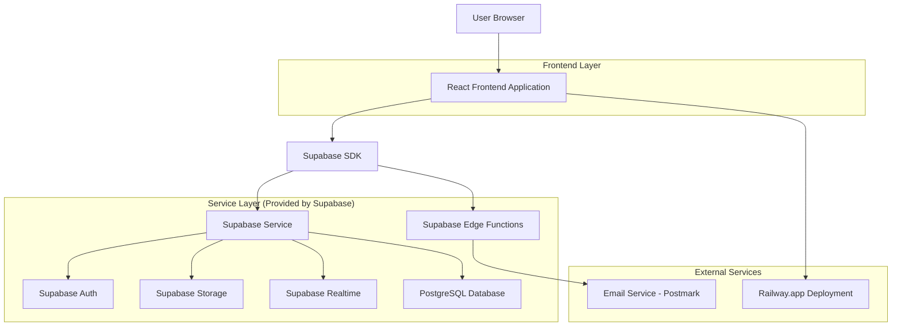
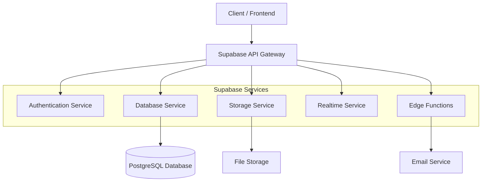
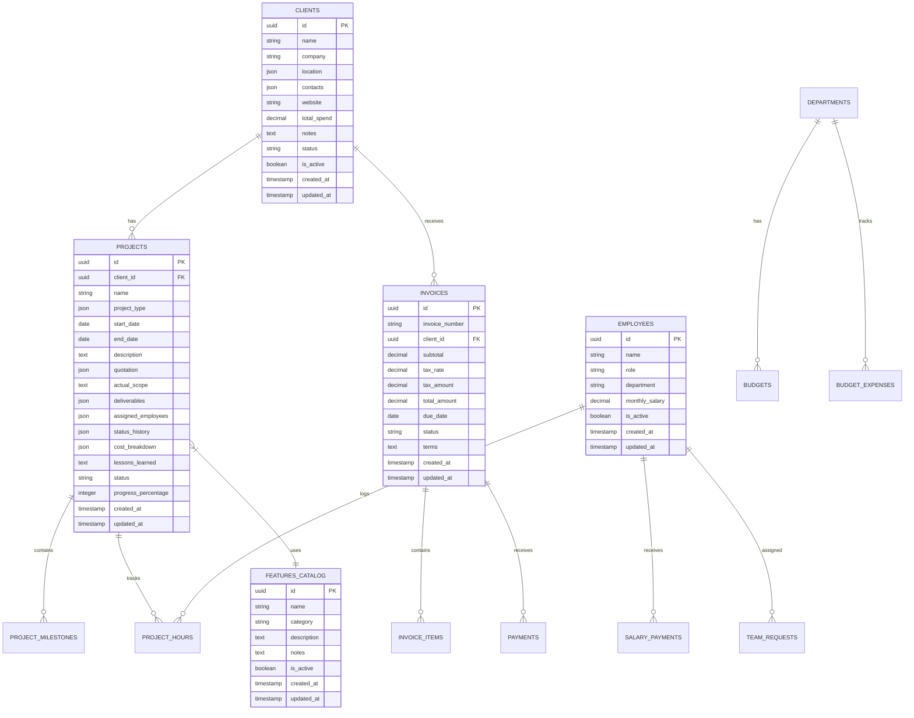

# Devs On Steroids Internal CRM - Technical Architecture Document

## 1. Architecture Design



## 2. Technology Description

- **Frontend**: React@18 + TypeScript + Vite + Tailwind CSS@3
- **UI Components**: shadcn/ui + Headless UI + TanStack Table + React Big Calendar + React Beautiful DnD
- **State Management**: React Query + Zustand
- **Form Handling**: React Hook Form + Zod validation
- **Charts**: Recharts
- **PDF Generation**: jsPDF + pdf-lib
- **Notifications**: react-hot-toast
- **Backend**: Supabase (PostgreSQL + Auth + Storage + Realtime + Edge Functions)
- **Deployment**: Railway.app

## 3. Route Definitions

| Route | Purpose |
|-------|---------|
| / | Dashboard home with business metrics and navigation |
| /login | Authentication page for admin user |
| /clients | Global client management and listing |
| /clients/:id | Individual client details with tabs |
| /projects | Global project management and tracking |
| /projects/:id | Individual project details and editing |
| /features | Features catalog for quoting and services |
| /invoices | Global invoice management and generation |
| /invoices/:id | Individual invoice details and PDF export |
| /reports | Business analytics and reporting dashboard |
| /salaries | Employee salary management and tracking |
| /requests | Internal team request management |
| /budgets | Department budget tracking and analysis |
| /settings | System configuration and company profile |

## 4. API Definitions

### 4.1 Core API

**Authentication**
```
POST /auth/v1/token
```
Request:
| Param Name | Param Type | isRequired | Description |
|------------|------------|------------|-------------|
| email | string | true | Admin user email |
| password | string | true | Admin user password |

Response:
| Param Name | Param Type | Description |
|------------|------------|-------------|
| access_token | string | JWT access token |
| refresh_token | string | JWT refresh token |
| user | object | User profile information |

**Client Management**
```
GET /rest/v1/clients
POST /rest/v1/clients
PATCH /rest/v1/clients?id=eq.{id}
DELETE /rest/v1/clients?id=eq.{id}
```

**Project Management**
```
GET /rest/v1/projects
POST /rest/v1/projects
PATCH /rest/v1/projects?id=eq.{id}
```

**Invoice Management**
```
GET /rest/v1/invoices
POST /rest/v1/invoices
PATCH /rest/v1/invoices?id=eq.{id}
```

**File Upload**
```
POST /storage/v1/object/{bucket_name}/{file_path}
```

**Email Notifications (Edge Functions)**
```
POST /functions/v1/send-invoice-email
POST /functions/v1/send-reminder-email
```

## 5. Server Architecture Diagram



## 6. Data Model

### 6.1 Data Model Definition



### 6.2 Data Definition Language

**Clients Table**
```sql
-- Create clients table
CREATE TABLE clients (
    id UUID PRIMARY KEY DEFAULT gen_random_uuid(),
    name VARCHAR(255) NOT NULL,
    company VARCHAR(255),
    location JSONB DEFAULT '{}',
    contacts JSONB DEFAULT '[]',
    website VARCHAR(500),
    total_spend DECIMAL(12,2) DEFAULT 0,
    notes TEXT,
    status VARCHAR(20) DEFAULT 'Lead' CHECK (status IN ('Active', 'Inactive', 'Lead')),
    is_active BOOLEAN DEFAULT true,
    created_at TIMESTAMP WITH TIME ZONE DEFAULT NOW(),
    updated_at TIMESTAMP WITH TIME ZONE DEFAULT NOW()
);

-- Create indexes
CREATE INDEX idx_clients_status ON clients(status);
CREATE INDEX idx_clients_company ON clients(company);
CREATE INDEX idx_clients_is_active ON clients(is_active);

-- Grant permissions
GRANT SELECT ON clients TO anon;
GRANT ALL PRIVILEGES ON clients TO authenticated;
```

**Projects Table**
```sql
-- Create projects table
CREATE TABLE projects (
    id UUID PRIMARY KEY DEFAULT gen_random_uuid(),
    client_id UUID REFERENCES clients(id),
    name VARCHAR(255) NOT NULL,
    project_type JSONB DEFAULT '[]',
    start_date DATE,
    end_date DATE,
    description TEXT,
    quotation JSONB DEFAULT '{}',
    actual_scope TEXT,
    deliverables JSONB DEFAULT '[]',
    assigned_employees JSONB DEFAULT '[]',
    status_history JSONB DEFAULT '[]',
    cost_breakdown JSONB DEFAULT '{}',
    lessons_learned TEXT,
    status VARCHAR(20) DEFAULT 'Backlog' CHECK (status IN ('Backlog', 'Ready to Quote', 'Quoted', 'Scheduled', 'In Progress', 'Completed', 'On Hold')),
    progress_percentage INTEGER DEFAULT 0 CHECK (progress_percentage >= 0 AND progress_percentage <= 100),
    created_at TIMESTAMP WITH TIME ZONE DEFAULT NOW(),
    updated_at TIMESTAMP WITH TIME ZONE DEFAULT NOW()
);

-- Create indexes
CREATE INDEX idx_projects_client_id ON projects(client_id);
CREATE INDEX idx_projects_status ON projects(status);
CREATE INDEX idx_projects_start_date ON projects(start_date);

-- Grant permissions
GRANT SELECT ON projects TO anon;
GRANT ALL PRIVILEGES ON projects TO authenticated;
```

**Invoices Table**
```sql
-- Create invoices table
CREATE TABLE invoices (
    id UUID PRIMARY KEY DEFAULT gen_random_uuid(),
    invoice_number VARCHAR(50) UNIQUE NOT NULL,
    client_id UUID REFERENCES clients(id),
    subtotal DECIMAL(12,2) NOT NULL DEFAULT 0,
    tax_rate DECIMAL(5,4) DEFAULT 0,
    tax_amount DECIMAL(12,2) DEFAULT 0,
    total_amount DECIMAL(12,2) NOT NULL DEFAULT 0,
    due_date DATE NOT NULL,
    status VARCHAR(20) DEFAULT 'Draft' CHECK (status IN ('Draft', 'Sent', 'Paid', 'Partial', 'Overdue')),
    terms TEXT DEFAULT 'Net 30',
    created_at TIMESTAMP WITH TIME ZONE DEFAULT NOW(),
    updated_at TIMESTAMP WITH TIME ZONE DEFAULT NOW()
);

-- Create indexes
CREATE INDEX idx_invoices_client_id ON invoices(client_id);
CREATE INDEX idx_invoices_status ON invoices(status);
CREATE INDEX idx_invoices_due_date ON invoices(due_date);
CREATE INDEX idx_invoices_number ON invoices(invoice_number);

-- Grant permissions
GRANT SELECT ON invoices TO anon;
GRANT ALL PRIVILEGES ON invoices TO authenticated;
```

**Employees Table**
```sql
-- Create employees table
CREATE TABLE employees (
    id UUID PRIMARY KEY DEFAULT gen_random_uuid(),
    name VARCHAR(100) NOT NULL,
    role VARCHAR(100) NOT NULL,
    department VARCHAR(50) NOT NULL,
    monthly_salary DECIMAL(10,2) DEFAULT 0,
    is_active BOOLEAN DEFAULT true,
    created_at TIMESTAMP WITH TIME ZONE DEFAULT NOW(),
    updated_at TIMESTAMP WITH TIME ZONE DEFAULT NOW()
);

-- Create indexes
CREATE INDEX idx_employees_department ON employees(department);
CREATE INDEX idx_employees_is_active ON employees(is_active);

-- Grant permissions
GRANT SELECT ON employees TO anon;
GRANT ALL PRIVILEGES ON employees TO authenticated;

-- Insert initial employee data
INSERT INTO employees (name, role, department) VALUES
('TJ', 'Co-Founder', 'Leadership'),
('Fusion', 'Senior FrontEnd', 'Development'),
('AlgoX', 'Senior BackEnd', 'Development'),
('Zenx', 'FrontEnd', 'Development'),
('White Bear', 'FrontEnd', 'Development'),
('Flux', 'Head of Mobile App', 'Mobile'),
('Codx', 'Head of Development', 'Development'),
('Byte', 'Head of Creative', 'Creative'),
('Red', 'Head of UI/UX', 'UI/UX'),
('Design Artistic', 'Head of GVI', 'Graphics/Video');
```

**Features Catalog Table**
```sql
-- Create features_catalog table
CREATE TABLE features_catalog (
    id UUID PRIMARY KEY DEFAULT gen_random_uuid(),
    name VARCHAR(255) NOT NULL,
    category VARCHAR(50) NOT NULL CHECK (category IN ('Development', 'Design', 'Mobile', 'E-comm', 'Other', 'Marketplace', 'GVI', 'Creative')),
    description TEXT,
    notes TEXT,
    is_active BOOLEAN DEFAULT true,
    created_at TIMESTAMP WITH TIME ZONE DEFAULT NOW(),
    updated_at TIMESTAMP WITH TIME ZONE DEFAULT NOW()
);

-- Create indexes
CREATE INDEX idx_features_category ON features_catalog(category);
CREATE INDEX idx_features_is_active ON features_catalog(is_active);

-- Grant permissions
GRANT SELECT ON features_catalog TO anon;
GRANT ALL PRIVILEGES ON features_catalog TO authenticated;

-- Insert initial features data
INSERT INTO features_catalog (name, category, description, notes) VALUES
('Multilingual Support (i18n)', 'Development', 'Full locale switching, RTL', 'Per language cost varies'),
('Role Based Access Control (RBAC)', 'Development', 'Admin/Employee panels', 'Custom roles possible'),
('Content Management System (CMS)', 'Development', 'Custom-coded backend', 'From-scratch, no Strapi'),
('Referral Management System', 'E-comm', 'Affiliate tracking', 'Custom Stripe payouts'),
('Custom UI/UX Design', 'Design', 'Wireframes to prototypes', 'Figma exports'),
('Payment Gateway Integration', 'E-comm', 'Custom Stripe/PayPal', 'Subscriptions support'),
('SEO Optimization', 'Other', 'On-page, schema markup', 'Analytics setup'),
('API Development/Integration', 'Development', 'Custom REST/GraphQL', 'Auth + rate limiting'),
('PWA Features', 'Development', 'Offline cache, push notifications', 'Service worker'),
('Cross-Platform Mobile App', 'Mobile', 'Custom React Native', 'iOS/Android'),
('Custom Illustrations', 'GVI', 'Vector graphics (10 assets)', 'Source files'),
('Video Editing/Animation', 'GVI', '2-min promo clip', '4K export'),
('Inventory Management', 'E-comm', 'Stock alerts, multi-warehouse', 'Custom ERP sync'),
('Subscription Billing', 'E-comm', 'Recurring + trials', 'Churn analytics'),
('Marketplace Vendor Dashboard', 'Marketplace', 'Listings, payouts', 'Custom commission calc'),
('Performance Optimization', 'Other', 'Speed <2s, Lighthouse 95+', 'Custom bundle analysis'),
('Security Audit', 'Other', 'OWASP top 10 fixes', 'Report + cert'),
('Maintenance Retainer', 'Other', 'Monthly updates/support', 'Hours-based'),
('Custom Dashboard Analytics', 'Development', 'Charts/reports', 'Recharts-based'),
('Brand Identity Kit', 'Creative', 'Logo, colors, guidelines', 'Full package');
```

**Additional Tables**
```sql
-- Create invoice_items table
CREATE TABLE invoice_items (
    id UUID PRIMARY KEY DEFAULT gen_random_uuid(),
    invoice_id UUID REFERENCES invoices(id) ON DELETE CASCADE,
    item_name VARCHAR(255) NOT NULL,
    description TEXT,
    quantity DECIMAL(10,2) DEFAULT 1,
    rate DECIMAL(10,2) NOT NULL,
    amount DECIMAL(12,2) NOT NULL,
    created_at TIMESTAMP WITH TIME ZONE DEFAULT NOW()
);

-- Create payments table
CREATE TABLE payments (
    id UUID PRIMARY KEY DEFAULT gen_random_uuid(),
    invoice_id UUID REFERENCES invoices(id),
    amount DECIMAL(12,2) NOT NULL,
    payment_date DATE NOT NULL,
    payment_method VARCHAR(50),
    notes TEXT,
    created_at TIMESTAMP WITH TIME ZONE DEFAULT NOW()
);

-- Create team_requests table
CREATE TABLE team_requests (
    id UUID PRIMARY KEY DEFAULT gen_random_uuid(),
    title VARCHAR(255) NOT NULL,
    description TEXT,
    priority VARCHAR(20) DEFAULT 'Medium' CHECK (priority IN ('Low', 'Medium', 'High')),
    assignee_id UUID REFERENCES employees(id),
    status VARCHAR(20) DEFAULT 'Backlog' CHECK (status IN ('Backlog', 'In Progress', 'Review', 'Completed')),
    due_date DATE,
    created_at TIMESTAMP WITH TIME ZONE DEFAULT NOW(),
    updated_at TIMESTAMP WITH TIME ZONE DEFAULT NOW()
);

-- Create budgets table
CREATE TABLE budgets (
    id UUID PRIMARY KEY DEFAULT gen_random_uuid(),
    department VARCHAR(50) NOT NULL,
    category VARCHAR(100) NOT NULL,
    budgeted_amount DECIMAL(12,2) NOT NULL,
    actual_amount DECIMAL(12,2) DEFAULT 0,
    period_start DATE NOT NULL,
    period_end DATE NOT NULL,
    created_at TIMESTAMP WITH TIME ZONE DEFAULT NOW(),
    updated_at TIMESTAMP WITH TIME ZONE DEFAULT NOW()
);

-- Grant permissions for all tables
GRANT SELECT ON invoice_items TO anon;
GRANT ALL PRIVILEGES ON invoice_items TO authenticated;
GRANT SELECT ON payments TO anon;
GRANT ALL PRIVILEGES ON payments TO authenticated;
GRANT SELECT ON team_requests TO anon;
GRANT ALL PRIVILEGES ON team_requests TO authenticated;
GRANT SELECT ON budgets TO anon;
GRAN