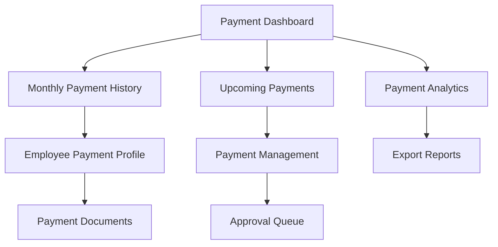

# HRM Salary Payment Tracking System - Product Requirements Document

## 1. Product Overview
A comprehensive salary payment tracking system that provides complete visibility into employee salary payments across different time periods, enabling HR teams to monitor past payments and plan for upcoming salary disbursements with detailed analytics and reporting capabilities.

The system addresses the critical need for transparent payroll management, financial planning, and compliance tracking by offering month-wise payment views, employee-specific payment histories, and predictive scheduling for future payments.

This feature enhances the existing HRM system by providing actionable insights into salary payment patterns and ensuring seamless payroll operations management.

## 2. Core Features

### 2.1 User Roles
| Role | Registration Method | Core Permissions |
|------|---------------------|------------------|
| HR Manager | Admin invitation with role assignment | Full access to all salary payment data, analytics, export, and management functions |
| HR Staff | HR Manager invitation | View salary payment data, generate reports, limited edit permissions |
| Finance Manager | Admin/HR Manager invitation | View payment data, approve payments, access financial analytics |
| Employee | System registration with employee verification | View only personal salary payment history and upcoming payments |

### 2.2 Feature Module
Our HRM Salary Payment Tracking System consists of the following main pages:
1. **Payment Dashboard**: Monthly payment overview, analytics widgets, payment status summaries, and key performance indicators.
2. **Monthly Payment History**: Past month-wise salary payments view with detailed employee breakdowns and payment status tracking.
3. **Upcoming Payments**: Scheduled and pending salary payments for future months with approval workflows and payment planning tools.
4. **Employee Payment Profile**: Individual employee salary payment history, payment patterns, and personal payment analytics.
5. **Payment Analytics**: Comprehensive reporting dashboard with payment trends, department-wise analysis, and financial insights.
6. **Payment Management**: Payment processing interface, bulk payment operations, and payment status management tools.

### 2.3 Page Details

| Page Name | Module Name | Feature description |
|-----------|-------------|---------------------|
| Payment Dashboard | Overview Cards | Display total monthly payments, pending amounts, payment success rates, and currency breakdowns with real-time updates |
| Payment Dashboard | Quick Actions | Provide shortcuts to process payments, generate reports, view overdue payments, and access payment approvals |
| Payment Dashboard | Recent Activity | Show latest payment transactions, status changes, and system notifications with timestamp tracking |
| Monthly Payment History | Month Selector | Navigate between different months and years with calendar interface and quick month selection |
| Monthly Payment History | Payment Grid | Display all employee payments for selected month with sortable columns, status indicators, and payment details |
| Monthly Payment History | Filter Controls | Filter by department, payment status, currency, employee type, and salary range with advanced search |
| Monthly Payment History | Export Options | Export monthly payment data to CSV, PDF, Excel formats with customizable report templates |
| Upcoming Payments | Payment Schedule | Show scheduled payments for next 3-6 months with calendar view and timeline visualization |
| Upcoming Payments | Approval Queue | Display payments pending approval with batch approval options and approval workflow tracking |
| Upcoming Payments | Payment Planning | Tools for scheduling future payments, setting payment dates, and managing payment cycles |
| Employee Payment Profile | Payment History Timeline | Chronological view of employee's salary payments with visual timeline and payment milestones |
| Employee Payment Profile | Payment Statistics | Employee-specific analytics including average salary, payment frequency, bonus history, and growth trends |
| Employee Payment Profile | Payment Documents | Access to payslips, tax documents, and payment confirmations with secure document storage |
| Payment Analytics | Trend Analysis | Visual charts showing payment trends over time, seasonal patterns, and year-over-year comparisons |
| Payment Analytics | Department Breakdown | Department-wise payment analysis with budget vs actual spending and cost center reporting |
| Payment Analytics | Currency Analytics | Multi-currency payment tracking with exchange rate impact analysis and currency distribution |
| Payment Management | Bulk Payment Processing | Process multiple payments simultaneously with validation, approval workflows, and error handling |
| Payment Management | Payment Status Tracking | Monitor payment processing status, handle failed payments, and manage payment retries |
| Payment Management | Payment Approval | Approval interface for managers with payment verification, approval history, and delegation options |

## 3. Core Process

### HR Manager Flow:
1. Access Payment Dashboard to view overall payment status and analytics
2. Navigate to Monthly Payment History to review past payments by month
3. Use filters to analyze specific departments, currencies, or payment statuses
4. Check Upcoming Payments to review scheduled payments and approve pending ones
5. Generate and export payment reports for financial planning and compliance
6. Use Payment Management tools to process bulk payments and handle exceptions

### Employee Flow:
1. Login to personal dashboard and access salary payment section
2. View personal payment history with detailed payment breakdowns
3. Check upcoming salary payments and payment schedules
4. Download payslips and payment confirmations
5. Track payment status and receive notifications for payment updates

### Finance Manager Flow:
1. Review payment analytics and financial summaries on dashboard
2. Analyze payment trends and budget vs actual spending patterns
3. Approve high-value payments and review payment exceptions
4. Generate financial reports for accounting and audit purposes
5. Monitor currency-wise payment distributions and exchange rate impacts

## 4. User Interface Design

### 4.1 Design Style
- **Primary Colors**: Blue (#3B82F6) for primary actions, Green (#10B981) for successful payments, Red (#EF4444) for failed payments
- **Secondary Colors**: Gray (#6B7280) for secondary text, Yellow (#F59E0B) for pending status, Purple (#8B5CF6) for analytics
- **Button Style**: Rounded corners (8px radius), subtle shadows, hover animations with color transitions
- **Font**: Inter or system fonts, 14px base size, 16px for headings, 12px for secondary text
- **Layout Style**: Card-based design with clean spacing, top navigation with breadcrumbs, sidebar for quick filters
- **Icons**: Lucide React icons for consistency, payment-specific icons for status indicators, currency symbols

### 4.2 Page Design Overview

| Page Name | Module Name | UI Elements |
|-----------|-------------|-------------|
| Payment Dashboard | Overview Cards | Large metric cards with icons, color-coded status indicators, progress bars for payment completion rates |
| Payment Dashboard | Charts Section | Interactive line charts for trends, donut charts for status distribution, bar charts for department comparison |
| Monthly Payment History | Data Table | Sortable table with alternating row colors, status badges, hover effects, pagination controls |
| Monthly Payment History | Filter Sidebar | Collapsible filter panel with checkboxes, date pickers, range sliders, and search inputs |
| Upcoming Payments | Calendar View | Monthly calendar with payment markers, color-coded by status, hover tooltips with payment details |
| Upcoming Payments | List View | Timeline-style list with payment cards, approval buttons, and status progression indicators |
| Employee Payment Profile | Profile Header | Employee photo, name, department, current salary, and quick stats in header section |
| Employee Payment Profile | Payment Timeline | Vertical timeline with payment milestones, interactive dots, and expandable payment details |
| Payment Analytics | Dashboard Layout | Grid layout with resizable chart widgets, filter controls in header, export buttons in toolbar |
| Payment Management | Action Panel | Bulk selection checkboxes, action buttons for batch operations, progress indicators for processing |

### 4.3 Responsiveness
The system is designed mobile-first with responsive breakpoints at 768px (tablet) and 1024px (desktop). Touch-optimized interfaces for mobile devices include larger tap targets, swipe gestures for navigation, and collapsible sections to maximize screen space. Desktop version features multi-column layouts, hover states, and keyboard shortcuts for power users.