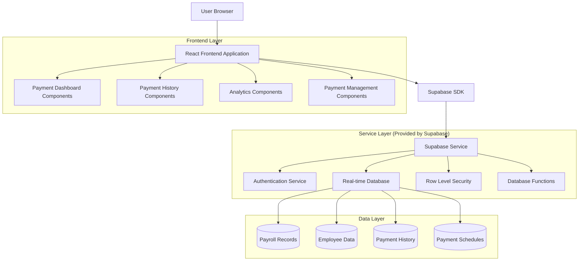
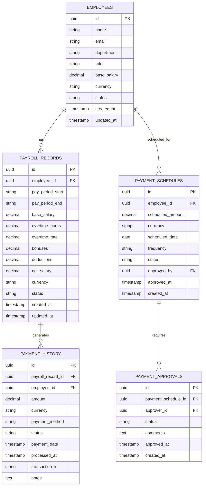

# HRM Salary Payment Tracking System - Technical Architecture Document

## 1. Architecture Design



## 2. Technology Description

- Frontend: React@18 + TypeScript + TailwindCSS@3 + Vite
- Backend: Supabase (PostgreSQL + Real-time + Auth + RLS)
- State Management: Zustand for global state, React Query for server state
- Charts: Recharts for payment analytics and trend visualization
- Date Handling: date-fns for date manipulation and formatting
- Export: react-csv for CSV exports, jsPDF for PDF generation

## 3. Route Definitions

| Route | Purpose |
|-------|---------|
| /hr/payments | Payment dashboard with overview metrics and quick actions |
| /hr/payments/history | Monthly payment history with filtering and search capabilities |
| /hr/payments/upcoming | Upcoming payments schedule and approval queue |
| /hr/payments/employee/:id | Individual employee payment profile and history |
| /hr/payments/analytics | Payment analytics dashboard with trends and insights |
| /hr/payments/manage | Payment management interface for processing and approvals |

## 4. API Definitions

### 4.1 Core API

Payment History Retrieval
```
GET /api/payments/history
```

Request:
| Param Name | Param Type | isRequired | Description |
|------------|------------|------------|-------------|
| month | string | false | Filter by specific month (YYYY-MM format) |
| year | string | false | Filter by specific year |
| employee_id | string | false | Filter by specific employee |
| department | string | false | Filter by department |
| status | string | false | Filter by payment status |
| currency | string | false | Filter by currency (USD/BDT) |

Response:
| Param Name | Param Type | Description |
|------------|------------|-------------|
| payments | array | Array of payment records with employee details |
| total_count | number | Total number of payment records |
| total_amount | object | Total payment amounts by currency |

Upcoming Payments Retrieval
```
GET /api/payments/upcoming
```

Request:
| Param Name | Param Type | isRequired | Description |
|------------|------------|------------|-------------|
| months_ahead | number | false | Number of months to look ahead (default: 3) |
| status | string | false | Filter by payment status (scheduled/pending/approved) |

Response:
| Param Name | Param Type | Description |
|------------|------------|-------------|
| scheduled_payments | array | Array of upcoming payment records |
| pending_approvals | array | Payments requiring approval |
| total_scheduled | object | Total scheduled amounts by currency |

Payment Analytics
```
GET /api/payments/analytics
```

Request:
| Param Name | Param Type | isRequired | Description |
|------------|------------|------------|-------------|
| start_date | string | true | Start date for analytics period |
| end_date | string | true | End date for analytics period |
| group_by | string | false | Group analytics by month/department/currency |

Response:
| Param Name | Param Type | Description |
|------------|------------|-------------|
| trends | array | Payment trend data over time |
| department_breakdown | array | Department-wise payment analysis |
| currency_distribution | object | Payment distribution by currency |
| growth_metrics | object | Payment growth and variance metrics |

## 5. Data Model

### 5.1 Data Model Definition



### 5.2 Data Definition Language

Payment History Table (payment_history)
```sql
-- Create payment history table
CREATE TABLE payment_history (
  id UUID PRIMARY KEY DEFAULT gen_random_uuid(),
  payroll_record_id UUID REFERENCES payroll_records(id) ON DELETE CASCADE,
  employee_id UUID REFERENCES employees(id) ON DELETE CASCADE,
  amount DECIMAL(12,2) NOT NULL,
  currency VARCHAR(3) DEFAULT 'USD' CHECK (currency IN ('USD', 'BDT')),
  payment_method VARCHAR(50) DEFAULT 'bank_transfer',
  status VARCHAR(20) DEFAULT 'pending' CHECK (status IN ('pending', 'processing', 'completed', 'failed', 'cancelled')),
  payment_date DATE NOT NULL,
  processed_at TIMESTAMP WITH TIME ZONE,
  transaction_id VARCHAR(100) UNIQUE,
  notes TEXT,
  created_at TIMESTAMP WITH TIME ZONE DEFAULT NOW(),
  updated_at TIMESTAMP WITH TIME ZONE DEFAULT NOW()
);

-- Create payment schedules table
CREATE TABLE payment_schedules (
  id UUID PRIMARY KEY DEFAULT gen_random_uuid(),
  employee_id UUID REFERENCES employees(id) ON DELETE CASCADE,
  scheduled_amount DECIMAL(12,2) NOT NULL,
  currency VARCHAR(3) DEFAULT 'USD' CHECK (currency IN ('USD', 'BDT')),
  scheduled_date DATE NOT NULL,
  frequency VARCHAR(20) DEFAULT 'monthly' CHECK (frequency IN ('weekly', 'bi_weekly', 'monthly', 'quarterly')),
  status VARCHAR(20) DEFAULT 'scheduled' CHECK (status IN ('scheduled', 'pending_approval', 'approved', 'processed', 'cancelled')),
  approved_by UUID REFERENCES employees(id),
  approved_at TIMESTAMP WITH TIME ZONE,
  created_at TIMESTAMP WITH TIME ZONE DEFAULT NOW(),
  updated_at TIMESTAMP WITH TIME ZONE DEFAULT NOW()
);

-- Create payment approvals table
CREATE TABLE payment_approvals (
  id UUID PRIMARY KEY DEFAULT gen_random_uuid(),
  payment_schedule_id UUID REFERENCES payment_schedules(id) ON DELETE CASCADE,
  approver_id UUID REFERENCES employees(id) ON DELETE CASCADE,
  status VARCHAR(20) DEFAULT 'pending' CHECK (status IN ('pending', 'approved', 'rejected')),
  comments TEXT,
  approved_at TIMESTAMP WITH TIME ZONE,
  created_at TIMESTAMP WITH TIME ZONE DEFAULT NOW()
);

-- Create indexes for performance
CREATE INDEX idx_payment_history_employee_id ON payment_history(employee_id);
CREATE INDEX idx_payment_history_payment_date ON payment_history(payment_date DESC);
CREATE INDEX idx_payment_history_status ON payment_history(status);
CREATE INDEX idx_payment_schedules_employee_id ON payment_schedules(employee_id);
CREATE INDEX idx_payment_schedules_scheduled_date ON payment_schedules(scheduled_date);
CREATE INDEX idx_payment_schedules_status ON payment_schedules(status);

-- Row Level Security policies
ALTER TABLE payment_history ENABLE ROW LEVEL SECURITY;
ALTER TABLE payment_schedules ENABLE ROW LEVEL SECURITY;
ALTER TABLE payment_approvals ENABLE ROW LEVEL SECURITY;

-- Grant permissions
GRANT SELECT ON payment_history TO anon;
GRANT ALL PRIVILEGES ON payment_history TO authenticated;
GRANT SELECT ON payment_schedules TO anon;
GRANT ALL PRIVILEGES ON payment_schedules TO authenticated;
GRANT SELECT ON payment_approvals TO anon;
GRANT ALL PRIVILEGES ON payment_approvals TO authenticated;

-- Create RLS policies
CREATE POLICY "Users can view payment history" ON payment_history FOR SELECT USING (true);
CREATE POLICY "Authenticated users can manage payment history" ON payment_history FOR ALL USING (auth.role() = 'authenticated');
CREATE POLICY "Users can view payment schedules" ON payment_schedules FOR SELECT USING (true);
CREATE POLICY "Authenticated users can manage payment schedules" ON payment_schedules FOR ALL USING (auth.role() = 'authenticated');
CREATE POLICY "Users can view payment approvals" ON payment_approvals FOR SELECT USING (true);
CREATE POLICY "Authenticated users can manage payment approvals" ON payment_approvals FOR ALL USING (auth.role() = 'authenticated');

-- Insert sample data
INSERT INTO payment_history (payroll_record_id, employee_id, amount, currency, payment_method, status, payment_date, processed_at, transaction_id)
SELECT 
  pr.id,
  pr.employee_id,
  pr.net_salary,
  pr.currency,
  'bank_transfer',
  'completed',
  (pr.pay_period_end::date + interval '5 days')::date,
  (pr.pay_period_end::date + interval '5 days' + interval '2 hours')::timestamp,
  'TXN_' || substr(md5(random()::text), 1, 10)
FROM payroll_records pr
WHERE pr.status = 'paid'
LIMIT 50;

-- Insert sample payment schedules
INSERT INTO payment_schedules (employee_id, scheduled_amount, currency, scheduled_date, frequency, status)
SELECT 
  e.id,
  e.base_salary,
  e.currency,
  (date_trunc('month', CURRENT_DATE) + interval '1 month' + interval '25 days')::date,
  'monthly',
  'scheduled'
FROM employees e
WHERE e.status = 'active'
LIMIT 20;
```