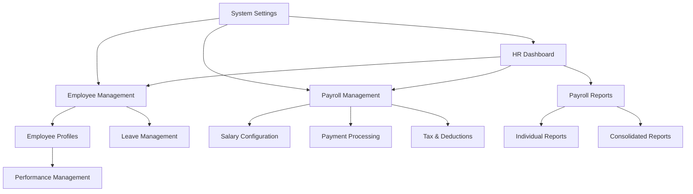

# Human Resource Management (HRM) System - Product Requirements Document

## 1. Product Overview

A comprehensive Human Resource Management system designed to replace the existing basic salaries tab with advanced employee management, payroll processing, reporting, and analytics capabilities. The system will streamline HR operations, ensure compliance, and provide detailed insights into workforce management and compensation.

The HRM system addresses the need for professional HR management in growing organizations by providing centralized employee data management, automated payroll processing, comprehensive reporting, and strategic workforce analytics to support business decision-making.

## 2. Core Features

### 2.1 User Roles

| Role | Registration Method | Core Permissions |
|------|---------------------|------------------|
| HR Administrator | Admin invitation with role assignment | Full access to all HR functions, employee management, payroll processing, system configuration |
| HR Manager | HR Admin invitation | Employee management, payroll processing, reporting access, limited system settings |
| Department Manager | HR invitation with department assignment | View department employees, approve leave requests, performance reviews for direct reports |
| Employee | HR Admin creation during onboarding | View personal profile, payroll history, leave balance, submit requests |

### 2.2 Feature Module

Our HRM system requirements consist of the following main pages:

1. **HR Dashboard**: Executive summary cards, payroll analytics, employee metrics, department insights, recent activities feed
2. **Employee Management**: Employee directory, profile management, role assignments, status tracking, document management
3. **Payroll Management**: Salary configuration, payment processing, currency conversion, tax calculations, bonus management
4. **Payroll Reports**: Individual payroll history, consolidated reports, financial projections, export capabilities
5. **Employee Profiles**: Detailed employee information, skills tracking, employment history, performance notes, document storage
6. **Leave Management**: Leave balance tracking, request processing, approval workflow, calendar integration
7. **Performance Management**: Performance reviews, goal tracking, salary adjustment recommendations, career development
8. **System Settings**: Currency settings, tax configuration, approval workflows, audit trail, security settings

### 2.3 Page Details

| Page Name | Module Name | Feature description |
|-----------|-------------|---------------------|
| HR Dashboard | Executive Summary | Display total employees, monthly payroll (USD/BDT), average salary, highest salary with real-time calculations |
| HR Dashboard | Analytics Charts | Visualize salary distribution, department breakdown, payroll trends with interactive charts |
| HR Dashboard | Recent Activities | Show recent employee additions, salary changes, leave requests, performance updates |
| Employee Management | Employee Directory | Search, filter, sort employees by department, role, status with pagination |
| Employee Management | Profile Management | Add, edit, delete employee records with validation and confirmation dialogs |
| Employee Management | Bulk Operations | Import employees via CSV, bulk status updates, mass communication tools |
| Payroll Management | Salary Configuration | Set base salaries, configure pay scales, manage salary bands by role/department |
| Payroll Management | Payment Processing | Process monthly payroll, handle one-time payments, manage payment schedules |
| Payroll Management | Currency Conversion | Real-time USD/BDT conversion, historical rate tracking, multi-currency reporting |
| Payroll Management | Tax & Deductions | Calculate income tax, provident fund, insurance deductions with configurable rates |
| Payroll Management | Bonus Management | Process performance bonuses, festival bonuses, commission calculations |
| Payroll Reports | Individual Reports | Generate employee-specific payroll history, tax statements, salary certificates |
| Payroll Reports | Consolidated Reports | Department-wise payroll summaries, monthly/annual expenditure reports |
| Payroll Reports | Financial Projections | Forecast future payroll costs, budget planning, cost analysis |
| Payroll Reports | Export Functions | Export reports to PDF, Excel, CSV with customizable templates |
| Employee Profiles | Personal Information | Manage contact details, emergency contacts, address, identification documents |
| Employee Profiles | Employment Details | Track joining date, probation period, confirmation date, leaving date if applicable |
| Employee Profiles | Skills & Qualifications | Record education, certifications, skills matrix, training history |
| Employee Profiles | Document Management | Upload and manage resume, contracts, certificates with version control |
| Employee Profiles | Notes & Comments | Add performance notes, HR comments, disciplinary records with timestamps |
| Leave Management | Leave Balance | Track annual leave, sick leave, casual leave balances with carry-forward rules |
| Leave Management | Request Processing | Submit, approve, reject leave requests with email notifications |
| Leave Management | Calendar Integration | Visual leave calendar, team availability, conflict detection |
| Performance Management | Review System | Conduct periodic reviews, set goals, track achievements with rating scales |
| Performance Management | Salary Adjustments | Recommend salary increases based on performance, approval workflow |
| System Settings | Configuration | Set up tax rates, currency preferences, company policies, approval hierarchies |
| System Settings | Audit Trail | Track all system changes, user activities, data modifications with timestamps |
| System Settings | Security Management | User access control, password policies, session management, data encryption |

## 3. Core Process

### HR Administrator Flow
1. **Employee Onboarding**: Create employee profile → Set salary details → Configure access permissions → Generate employment contract → Send welcome email
2. **Payroll Processing**: Review monthly payroll → Apply bonuses/deductions → Process payments → Generate payslips → Update financial records
3. **Reporting**: Access dashboard analytics → Generate custom reports → Export financial data → Share with management

### HR Manager Flow
1. **Daily Operations**: Review pending requests → Approve leave applications → Update employee records → Monitor payroll status
2. **Monthly Tasks**: Process department payroll → Review performance metrics → Generate department reports → Plan recruitment needs

### Department Manager Flow
1. **Team Management**: View team members → Approve leave requests → Conduct performance reviews → Recommend salary adjustments
2. **Reporting**: Access team analytics → Review department costs → Submit budget requests

### Employee Flow
1. **Self-Service**: View personal profile → Check payroll history → Submit leave requests → Update personal information → Download payslips

## 4. User Interface Design

### 4.1 Design Style

- **Primary Colors**: Professional blue (#2563eb) for primary actions, green (#059669) for success states, red (#dc2626) for alerts
- **Secondary Colors**: Gray scale (#f8fafc to #1e293b) for backgrounds and text, amber (#f59e0b) for warnings
- **Button Style**: Rounded corners (8px), subtle shadows, hover animations with color transitions
- **Font**: Inter font family, 14px base size, 16px for headings, 12px for captions
- **Layout Style**: Card-based design with clean spacing, top navigation with breadcrumbs, sidebar for quick access
- **Icons**: Lucide React icons for consistency, professional appearance with 16px-20px sizes

### 4.2 Page Design Overview

| Page Name | Module Name | UI Elements |
|-----------|-------------|-------------|
| HR Dashboard | Executive Summary | Large metric cards with icons, color-coded status indicators, animated counters |
| HR Dashboard | Analytics Charts | Interactive bar/pie charts, responsive design, hover tooltips, export buttons |
| Employee Management | Directory Table | Sortable columns, search filters, pagination controls, action buttons with icons |
| Employee Management | Profile Forms | Multi-step forms, progress indicators, validation messages, file upload areas |
| Payroll Management | Salary Grid | Editable table cells, currency formatters, calculation previews, bulk edit options |
| Payroll Management | Payment Interface | Step-by-step wizard, confirmation dialogs, progress tracking, success animations |
| Payroll Reports | Report Builder | Filter panels, date pickers, template selection, preview pane, download options |
| Employee Profiles | Information Tabs | Tabbed interface, collapsible sections, document thumbnails, edit overlays |
| Leave Management | Calendar View | Monthly/weekly calendar, color-coded leave types, drag-drop functionality |
| Performance Management | Review Forms | Rating scales, comment boxes, goal tracking, progress bars, approval workflow |
| System Settings | Configuration Panels | Grouped settings, toggle switches, input validation, save confirmations |

### 4.3 Responsiveness

The HRM system is designed with a desktop-first approach optimized for HR professionals working on computers, with mobile-adaptive features for managers and employees accessing the system on tablets and smartphones. Touch interaction optimization includes larger tap targets, swipe gestures for navigation, and simplified mobile interfaces for common tasks like leave requests and payroll viewing.