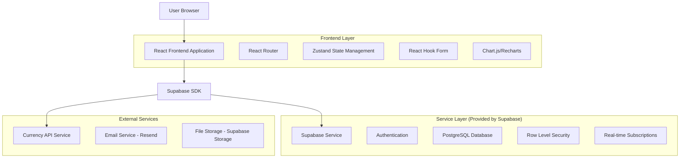
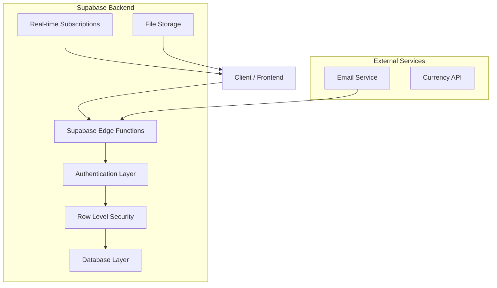
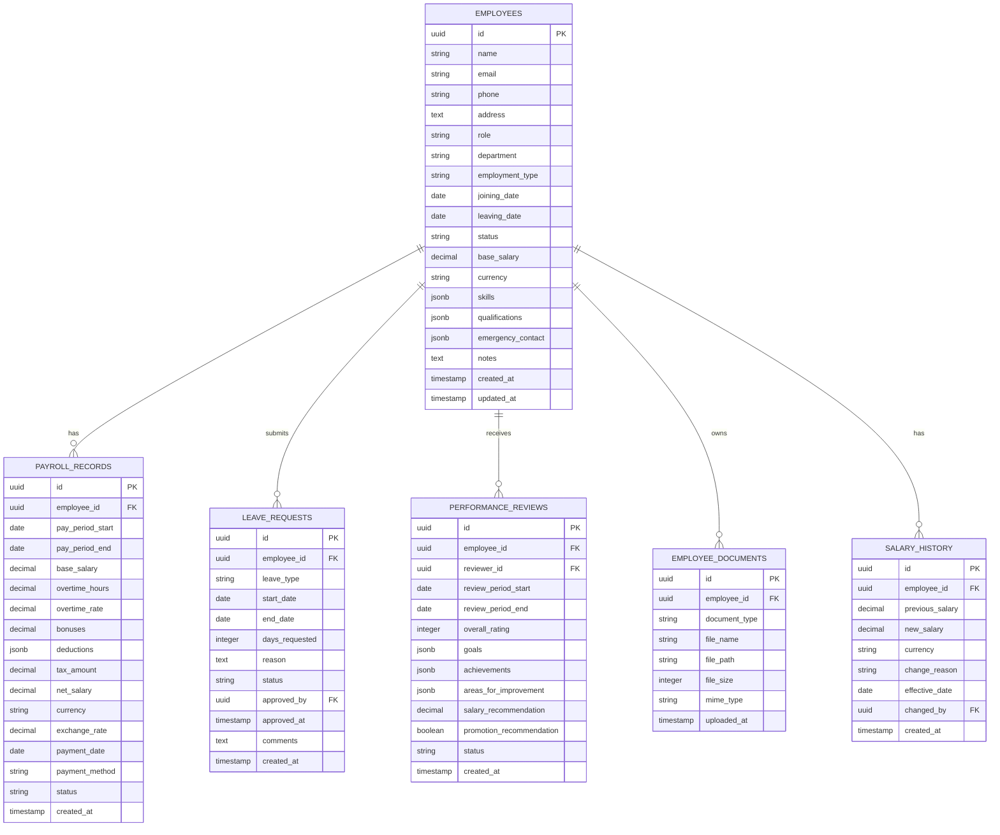

# Human Resource Management (HRM) System - Technical Architecture Document

## 1. Architecture Design



## 2. Technology Description

- **Frontend**: React@18 + TypeScript + Tailwind CSS@3 + Vite
- **Backend**: Supabase (Authentication, Database, Storage, Real-time)
- **State Management**: Zustand for global state, React Hook Form for form management
- **Charts & Analytics**: Recharts for data visualization
- **External APIs**: Currency conversion API, Email service (Resend)

## 3. Route Definitions

| Route | Purpose |
|-------|---------|
| /hr | HR Dashboard with analytics and summary metrics |
| /hr/employees | Employee directory and management interface |
| /hr/employees/:id | Individual employee profile and details |
| /hr/employees/new | Add new employee form |
| /hr/payroll | Payroll management and processing interface |
| /hr/payroll/process | Monthly payroll processing workflow |
| /hr/reports | Payroll reports and analytics dashboard |
| /hr/reports/individual/:id | Individual employee payroll history |
| /hr/reports/consolidated | Consolidated payroll reports |
| /hr/leave | Leave management and calendar view |
| /hr/leave/requests | Leave request processing interface |
| /hr/performance | Performance management and reviews |
| /hr/settings | System configuration and preferences |
| /hr/settings/audit | Audit trail and system logs |

## 4. API Definitions

### 4.1 Core API

**Employee Management**
```
GET /api/employees
POST /api/employees
PUT /api/employees/:id
DELETE /api/employees/:id
```

**Payroll Operations**
```
GET /api/payroll/summary
POST /api/payroll/process
GET /api/payroll/history/:employeeId
POST /api/payroll/adjustments
```

**Leave Management**
```
GET /api/leave/balance/:employeeId
POST /api/leave/request
PUT /api/leave/approve/:requestId
GET /api/leave/calendar
```

**Reporting**
```
GET /api/reports/payroll
GET /api/reports/employee/:id
POST /api/reports/export
GET /api/reports/analytics
```

### 4.2 TypeScript Interfaces

```typescript
interface Employee {
  id: string;
  name: string;
  email: string;
  phone?: string;
  address?: string;
  role: string;
  department: string;
  employment_type: 'full_time' | 'part_time' | 'contract' | 'intern';
  joining_date: string;
  leaving_date?: string;
  status: 'active' | 'inactive' | 'on_leave' | 'terminated';
  base_salary: number;
  currency: 'USD' | 'BDT';
  skills: string[];
  qualifications: string[];
  emergency_contact?: EmergencyContact;
  documents: Document[];
  notes: string;
  created_at: string;
  updated_at: string;
}

interface PayrollRecord {
  id: string;
  employee_id: string;
  pay_period_start: string;
  pay_period_end: string;
  base_salary: number;
  overtime_hours?: number;
  overtime_rate?: number;
  bonuses: number;
  deductions: Deduction[];
  tax_amount: number;
  net_salary: number;
  currency: 'USD' | 'BDT';
  exchange_rate?: number;
  payment_date?: string;
  payment_method?: string;
  status: 'draft' | 'processed' | 'paid';
  created_at: string;
}

interface LeaveRequest {
  id: string;
  employee_id: string;
  leave_type: 'annual' | 'sick' | 'casual' | 'maternity' | 'paternity';
  start_date: string;
  end_date: string;
  days_requested: number;
  reason: string;
  status: 'pending' | 'approved' | 'rejected';
  approved_by?: string;
  approved_at?: string;
  comments?: string;
  created_at: string;
}

interface PerformanceReview {
  id: string;
  employee_id: string;
  reviewer_id: string;
  review_period_start: string;
  review_period_end: string;
  overall_rating: number;
  goals: Goal[];
  achievements: string[];
  areas_for_improvement: string[];
  salary_recommendation?: number;
  promotion_recommendation?: boolean;
  status: 'draft' | 'submitted' | 'approved';
  created_at: string;
}
```

## 5. Server Architecture Diagram



## 6. Data Model

### 6.1 Data Model Definition



### 6.2 Data Definition Language

**Employees Table (Enhanced)**
```sql
-- Drop existing employees table and recreate with enhanced schema
DROP TABLE IF EXISTS employees CASCADE;

CREATE TABLE employees (
    id UUID PRIMARY KEY DEFAULT gen_random_uuid(),
    name VARCHAR(100) NOT NULL,
    email VARCHAR(255) UNIQUE,
    phone VARCHAR(20),
    address TEXT,
    role VARCHAR(100) NOT NULL,
    department VARCHAR(50) NOT NULL,
    employment_type VARCHAR(20) DEFAULT 'full_time' CHECK (employment_type IN ('full_time', 'part_time', 'contract', 'intern')),
    joining_date DATE NOT NULL,
    leaving_date DATE,
    status VARCHAR(20) DEFAULT 'active' CHECK (status IN ('active', 'inactive', 'on_leave', 'terminated')),
    base_salary DECIMAL(12,2) DEFAULT 0,
    currency VARCHAR(3) DEFAULT 'USD' CHECK (currency IN ('USD', 'BDT')),
    skills JSONB DEFAULT '[]',
    qualifications JSONB DEFAULT '[]',
    emergency_contact JSONB DEFAULT '{}',
    notes TEXT,
    created_at TIMESTAMP WITH TIME ZONE DEFAULT NOW(),
    updated_at TIMESTAMP WITH TIME ZONE DEFAULT NOW()
);

-- Create indexes
CREATE INDEX idx_employees_email ON employees(email);
CREATE INDEX idx_employees_department ON employees(department);
CREATE INDEX idx_employees_status ON employees(status);
CREATE INDEX idx_employees_employment_type ON employees(employment_type);

-- Payroll Records Table
CREATE TABLE payroll_records (
    id UUID PRIMARY KEY DEFAULT gen_random_uuid(),
    employee_id UUID REFERENCES employees(id) ON DELETE CASCADE,
    pay_period_start DATE NOT NULL,
    pay_period_end DATE NOT NULL,
    base_salary DECIMAL(12,2) NOT NULL,
    overtime_hours DECIMAL(5,2) DEFAULT 0,
    overtime_rate DECIMAL(8,2) DEFAULT 0,
    bonuses DECIMAL(10,2) DEFAULT 0,
    deductions JSONB DEFAULT '[]',
    tax_amount DECIMAL(10,2) DEFAULT 0,
    net_salary DECIMAL(12,2) NOT NULL,
    currency VARCHAR(3) DEFAULT 'USD' CHECK (currency IN ('USD', 'BDT')),
    exchange_rate DECIMAL(10,4),
    payment_date DATE,
    payment_method VARCHAR(50),
    status VARCHAR(20) DEFAULT 'draft' CHECK (status IN ('draft', 'processed', 'paid')),
    created_at TIMESTAMP WITH TIME ZONE DEFAULT NOW(),
    updated_at TIMESTAMP WITH TIME ZONE DEFAULT NOW()
);

-- Create indexes
CREATE INDEX idx_payroll_employee_id ON payroll_records(employee_id);
CREATE INDEX idx_payroll_pay_period ON payroll_records(pay_period_start, pay_period_end);
CREATE INDEX idx_payroll_status ON payroll_records(status);

-- Leave Requests Table
CREATE TABLE leave_requests (
    id UUID PRIMARY KEY DEFAULT gen_random_uuid(),
    employee_id UUID REFERENCES employees(id) ON DELETE CASCADE,
    leave_type VARCHAR(20) NOT NULL CHECK (leave_type IN ('annual', 'sick', 'casual', 'maternity', 'paternity')),
    start_date DATE NOT NULL,
    end_date DATE NOT NULL,
    days_requested INTEGER NOT NULL,
    reason TEXT,
    status VARCHAR(20) DEFAULT 'pending' CHECK (status IN ('pending', 'approved', 'rejected')),
    approved_by UUID REFERENCES employees(id),
    approved_at TIMESTAMP WITH TIME ZONE,
    comments TEXT,
    created_at TIMESTAMP WITH TIME ZONE DEFAULT NOW(),
    updated_at TIMESTAMP WITH TIME ZONE DEFAULT NOW()
);

-- Create indexes
CREATE INDEX idx_leave_employee_id ON leave_requests(employee_id);
CREATE INDEX idx_leave_status ON leave_requests(status);
CREATE INDEX idx_leave_dates ON leave_requests(start_date, end_date);

-- Performance Reviews Table
CREATE TABLE performance_reviews (
    id UUID PRIMARY KEY DEFAULT gen_random_uuid(),
    employee_id UUID REFERENCES employees(id) ON DELETE CASCADE,
    reviewer_id UUID REFERENCES employees(id),
    review_period_start DATE NOT NULL,
    review_period_end DATE NOT NULL,
    overall_rating INTEGER CHECK (overall_rating >= 1 AND overall_rating <= 5),
    goals JSONB DEFAULT '[]',
    achievements JSONB DEFAULT '[]',
    areas_for_improvement JSONB DEFAULT '[]',
    salary_recommendation DECIMAL(12,2),
    promotion_recommendation BOOLEAN DEFAULT false,
    status VARCHAR(20) DEFAULT 'draft' CHECK (status IN ('draft', 'submitted', 'approved')),
    created_at TIMESTAMP WITH TIME ZONE DEFAULT NOW(),
    updated_at TIMESTAMP WITH TIME ZONE DEFAULT NOW()
);

-- Create indexes
CREATE INDEX idx_performance_employee_id ON performance_reviews(employee_id);
CREATE INDEX idx_performance_reviewer_id ON performance_reviews(reviewer_id);
CREATE INDEX idx_performance_status ON performance_reviews(status);

-- Employee Documents Table
CREATE TABLE employee_documents (
    id UUID PRIMARY KEY DEFAULT gen_random_uuid(),
    employee_id UUID REFERENCES employees(id) ON DELETE CASCADE,
    document_type VARCHAR(50) NOT NULL CHECK (document_type IN ('resume', 'contract', 'certificate', 'id_document', 'other')),
    file_name VARCHAR(255) NOT NULL,
    file_path VARCHAR(500) NOT NULL,
    file_size INTEGER,
    mime_type VARCHAR(100),
    uploaded_at TIMESTAMP WITH TIME ZONE DEFAULT NOW()
);

-- Create indexes
CREATE INDEX idx_documents_employee_id ON employee_documents(employee_id);
CREATE INDEX idx_documents_type ON employee_documents(document_type);

-- Salary History Table
CREATE TABLE salary_history (
    id UUID PRIMARY KEY DEFAULT gen_random_uuid(),
    employee_id UUID REFERENCES employees(id) ON DELETE CASCADE,
    previous_salary DECIMAL(12,2),
    new_salary DECIMAL(12,2) NOT NULL,
    currency VARCHAR(3) DEFAULT 'USD' CHECK (currency IN ('USD', 'BDT')),
    change_reason VARCHAR(255),
    effective_date DATE NOT NULL,
    changed_by UUID REFERENCES employees(id),
    created_at TIMESTAMP WITH TIME ZONE DEFAULT NOW()
);

-- Create indexes
CREATE INDEX idx_salary_history_employee_id ON salary_history(employee_id);
CREATE INDEX idx_salary_history_effective_date ON salary_history(effective_date);

-- Row Level Security Policies
ALTER TABLE employees ENABLE ROW LEVEL SECURITY;
ALTER TABLE payroll_records ENABLE ROW LEVEL SECURITY;
ALTER TABLE leave_requests ENABLE ROW LEVEL SECURITY;
ALTER TABLE performance_reviews ENABLE ROW LEVEL SECURITY;
ALTER TABLE employee_documents ENABLE ROW LEVEL SECURITY;
ALTER TABLE salary_history ENABLE ROW LEVEL SECURITY;

-- Grant permissions
GRANT SELECT ON employees TO anon;
GRANT ALL PRIVILEGES ON employees TO authenticated;
GRANT ALL PRIVILEGES ON payroll_records TO authenticated;
GRANT ALL PRIVILEGES ON leave_requests TO authenticated;
GRANT ALL PRIVILEGES ON performance_reviews TO authenticated;
GRANT ALL PRIVILEGES ON employee_documents TO authenticated;
GRANT ALL PRIVILEGES ON salary_history TO authenticated;

-- Insert sample data
INSERT INTO employees (name, email, role, department, joining_date, base_salary, currency, status) VALUES
('Alice Johnson', 'alice@company.com', 'Senior Developer', 'Engineering', '2023-01-15', 8500.00, 'USD', 'active'),
('Bob Smith', 'bob@company.com', 'UI/UX Designer', 'Design', '2023-03-01', 6500.00, 'USD', 'active'),
('Carol Williams', 'carol@company.com', 'Project Manager', 'Management', '2022-11-10', 7500.00, 'USD', 'active'),
('David Brown', 'david@company.com', 'Backend Developer', 'Engineering', '2023-06-01', 7000.00, 'USD', 'active');
```